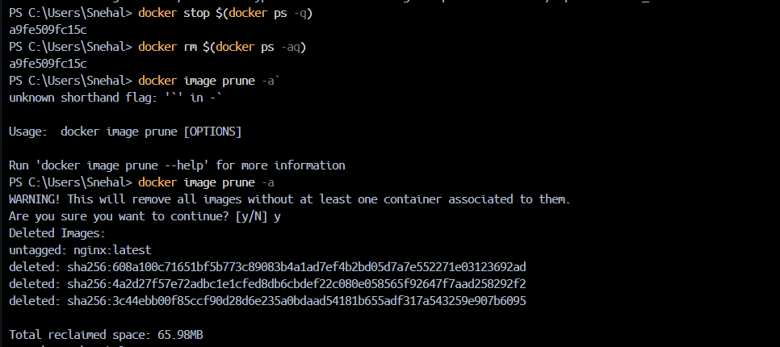
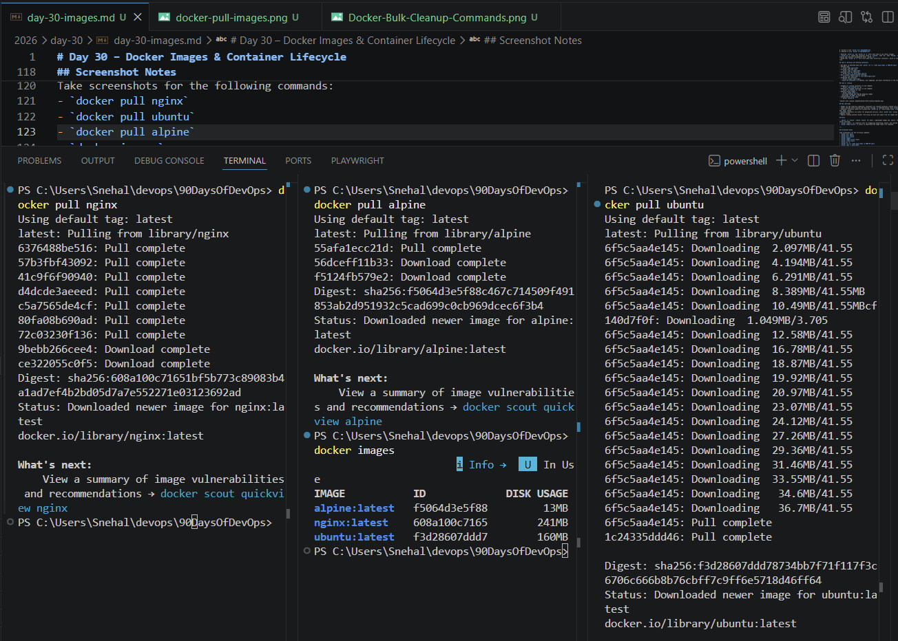

# Day 30 – Docker Images & Container Lifecycle

## Goal
Understand how Docker images and containers work, learn the relationship between images and containers, inspect image layers, and practice the full container lifecycle.

## Task 1: Docker Images

- Pulled images:
  - `docker pull nginx`
  - `docker pull ubuntu`
  - `docker pull alpine`

- List of images on machine:
````
PS C:\Users\Snehal> docker images
                                                                                                                                                     i Info →   U  In Use
IMAGE           ID             DISK USAGE   CONTENT SIZE   EXTRA
alpine:latest   f5064d3e5f88         13MB         3.93MB
nginx:latest    608a100c7165        241MB           66MB
ubuntu:latest   f3d28607ddd7        160MB         45.3MB    U 
PS C:\Users\Snehal>

````


  - plus any intermediate or cached images created by Docker

- Size comparison:
  - `ubuntu` is much larger than `alpine` because Ubuntu includes a full userland and many utilities.
  - `alpine` is intentionally minimal, built around a tiny base and using `musl` libc instead of `glibc`.
  - Smaller images reduce download time and attack surface.

- Image inspection:
  - Used `docker inspect nginx` to view metadata such as `Id`, `RepoTags`, `RepoDigests`, and `Created` timestamp.
  - The config section shows `ExposedPorts` (`80/tcp`), environment variables, `Entrypoint` (`/docker-entrypoint.sh`), `Cmd` (`nginx -g daemon off;`), labels, and `StopSignal` (`SIGQUIT`).
  - Additional metadata includes `Architecture` (`amd64`), `Os` (`linux`), and image `Size` (`63125971` bytes).
  - The `RootFS` section confirms the image is stored as layered filesystem diffs and lists the layer digests.

- Removed an image no longer needed:
  - Removed one of the pulled images with `docker rmi <image>` to free local disk space.

## Task 2: Image Layers

- Command: `docker image history nginx`

````
PS C:\Users\Snehal> docker image history nginx
IMAGE          CREATED      CREATED BY                                      SIZE      COMMENT
608a100c7165   5 days ago   CMD ["nginx" "-g" "daemon off;"]                0B        buildkit.dockerfile.v0
<missing>      5 days ago   STOPSIGNAL SIGQUIT                              0B        buildkit.dockerfile.v0
<missing>      5 days ago   EXPOSE map[80/tcp:{}]                           0B        buildkit.dockerfile.v0
<missing>      5 days ago   ENTRYPOINT ["/docker-entrypoint.sh"]            0B        buildkit.dockerfile.v0
<missing>      5 days ago   COPY 30-tune-worker-processes.sh /docker-ent…   16.4kB    buildkit.dockerfile.v0
<missing>      5 days ago   COPY 20-envsubst-on-templates.sh /docker-ent…   12.3kB    buildkit.dockerfile.v0
<missing>      5 days ago   COPY 15-local-resolvers.envsh /docker-entryp…   12.3kB    buildkit.dockerfile.v0
<missing>      5 days ago   COPY 10-listen-on-ipv6-by-default.sh /docker…   12.3kB    buildkit.dockerfile.v0
<missing>      5 days ago   COPY docker-entrypoint.sh / # buildkit          8.19kB    buildkit.dockerfile.v0
<missing>      5 days ago   RUN /bin/sh -c set -x     && groupadd --syst…   87.1MB    buildkit.dockerfile.v0
<missing>      5 days ago   ENV DYNPKG_RELEASE=1~trixie                     0B        buildkit.dockerfile.v0
<missing>      5 days ago   ENV PKG_RELEASE=1~trixie                        0B        buildkit.dockerfile.v0
<missing>      5 days ago   ENV ACME_VERSION=0.4.1                          0B        buildkit.dockerfile.v0
<missing>      5 days ago   ENV NJS_RELEASE=1~trixie                        0B        buildkit.dockerfile.v0
<missing>      5 days ago   ENV NJS_VERSION=0.9.9                           0B        buildkit.dockerfile.v0
<missing>      5 days ago   ENV NGINX_VERSION=1.31.1                        0B        buildkit.dockerfile.v0
<missing>      5 days ago   LABEL maintainer=NGINX Docker Maintainers <d…   0B        buildkit.dockerfile.v0
<missing>      6 days ago   # debian.sh --arch 'amd64' out/ 'trixie' '@1…   87.4MB    debuerreotype 0.17
PS C:\Users\Snehal>

````

- Actual output summary:
  - The top layer is the `CMD ["nginx" "-g" "daemon off;"]` instruction and shows `0B`.
  - Several metadata layers such as `STOPSIGNAL SIGQUIT`, `EXPOSE 80`, `ENTRYPOINT`, and environment variable `ENV` lines also show `0B`.
  - The `COPY` steps for Nginx entrypoint scripts show small sizes like `16.4kB`, `12.3kB`, and `8.19kB`.
  - A large `RUN` step shows `87.1MB`, which includes package installation and system setup.
  - The base Debian layer from `debuerreotype` shows `87.4MB`.

- Observations:
  - Each line in the output represents a layer built on top of the previous layer.
  - Layers with `0B` mean the instruction did not add new files to the filesystem; they represent metadata, configuration, or commands that do not change contents.
  - Layers with non-zero size correspond to actual filesystem changes like copied files or installed packages.

- What are layers and why Docker uses them?
  - Layers are filesystem diffs that store only the changes made by each Dockerfile instruction.
  - Docker uses layers for caching and reuse; if a layer is already available locally, Docker can skip rebuilding that layer.
  - Layers make builds faster, images smaller, and enable efficient distribution by sharing identical layers across images.

## Task 3: Container Lifecycle

Practiced the container lifecycle with a single container:

1. Created a container without starting it using `docker create nginx`.
   - Container ID: `02d1bd48d7ce73eb5570a7ee764085ae8ef4ce8f90a76b6e587b4eb64aad27e7`
2. Docker Start: `docker start 02d1bd48d7ce73eb5570a7ee764085ae8ef4ce8f90a76b6e587b4eb64aad27e7`.
3. Verified the container was running with `docker ps`.
4. Paused it with `docker pause 02d1bd48d7ce73`.
5. Confirmed the paused status with `docker ps` showing `Up ... (Paused)`.
6. Stopped it using `docker stop 02d1bd48d7ce73`.
7. Restarted it with `docker restart 02d1bd48d7ce73`.
8. Killed it with `docker kill 02d1bd48d7ce73`.
9. Removed it with `docker rm 02d1bd48d7ce73`.

- Observed `docker ps` and `docker ps -a` after each step to see status changes.
- `docker ps -a` showed the container state as `Created`, then `Up`, then `Paused`, then `Exited (137)` after kill, and finally the container disappeared after `docker rm`.
- Noted that `docker ps -a` also lists many other historical containers, which is useful for cleanup and tracking previous runs.

## Task 4: Working with Running Containers

- Ran Nginx in detached mode with `docker run -d --name nginx-demo -p 8080:80 nginx`
````
PS C:\Users\Snehal> docker run -d --name nginx-demo -p 8080:80 nginx
89791acb6d472378a51adc4651a3d362c0cf545ca6522c42c0efc6a75a8ecd4f

````
- Checked logs:
  - `docker logs nginx-demo`
````
PS C:\Users\Snehal\devops\90DaysOfDevOps> docker logs nginx-demo
/docker-entrypoint.sh: /docker-entrypoint.d/ is not empty, will attempt to perform configuration
/docker-entrypoint.sh: Looking for shell scripts in /docker-entrypoint.d/
/docker-entrypoint.sh: Launching /docker-entrypoint.d/10-listen-on-ipv6-by-default.sh
10-listen-on-ipv6-by-default.sh: info: Getting the checksum of /etc/nginx/conf.d/default.conf
10-listen-on-ipv6-by-default.sh: info: Enabled listen on IPv6 in /etc/nginx/conf.d/default.conf
/docker-entrypoint.sh: Sourcing /docker-entrypoint.d/15-local-resolvers.envsh
/docker-entrypoint.sh: Launching /docker-entrypoint.d/20-envsubst-on-templates.sh
/docker-entrypoint.sh: Launching /docker-entrypoint.d/30-tune-worker-processes.sh
/docker-entrypoint.sh: Configuration complete; ready for start up
2026/06/16 13:40:12 [notice] 1#1: using the "epoll" event method
2026/06/16 13:40:12 [notice] 1#1: nginx/1.31.1
2026/06/16 13:40:12 [notice] 1#1: built by gcc 14.2.0 (Debian 14.2.0-19) 
2026/06/16 13:40:12 [notice] 1#1: OS: Linux 6.6.114.1-microsoft-standard-WSL2
2026/06/16 13:40:12 [notice] 1#1: getrlimit(RLIMIT_NOFILE): 1048576:1048576
2026/06/16 13:40:12 [notice] 1#1: start worker processes
2026/06/16 13:40:12 [notice] 1#1: start worker process 29
2026/06/16 13:40:12 [notice] 1#1: start worker process 30
2026/06/16 13:40:12 [notice] 1#1: start worker process 31
2026/06/16 13:40:12 [notice] 1#1: start worker process 32
2026/06/16 13:40:12 [notice] 1#1: start worker process 33
2026/06/16 13:40:12 [notice] 1#1: start worker process 34
2026/06/16 13:40:12 [notice] 1#1: start worker process 35
2026/06/16 13:40:12 [notice] 1#1: start worker process 36

What's next:
    View and search logs for all containers in one place
    with Docker Desktop's Logs view. docker-desktop://dashboard/logs

````

- Followed real-time logs:
  - `docker logs -f nginx-demo`

````
PS C:\Users\Snehal\devops\90DaysOfDevOps> docker logs -f nginx-demo
/docker-entrypoint.sh: /docker-entrypoint.d/ is not empty, will attempt to perform configuration
/docker-entrypoint.sh: Looking for shell scripts in /docker-entrypoint.d/
/docker-entrypoint.sh: Launching /docker-entrypoint.d/10-listen-on-ipv6-by-default.sh
10-listen-on-ipv6-by-default.sh: info: Getting the checksum of /etc/nginx/conf.d/default.conf
10-listen-on-ipv6-by-default.sh: info: Enabled listen on IPv6 in /etc/nginx/conf.d/default.conf
/docker-entrypoint.sh: Sourcing /docker-entrypoint.d/15-local-resolvers.envsh
/docker-entrypoint.sh: Launching /docker-entrypoint.d/20-envsubst-on-templates.sh
/docker-entrypoint.sh: Launching /docker-entrypoint.d/30-tune-worker-processes.sh
/docker-entrypoint.sh: Configuration complete; ready for start up
2026/06/16 13:40:12 [notice] 1#1: using the "epoll" event method
2026/06/16 13:40:12 [notice] 1#1: nginx/1.31.1
2026/06/16 13:40:12 [notice] 1#1: built by gcc 14.2.0 (Debian 14.2.0-19) 
2026/06/16 13:40:12 [notice] 1#1: OS: Linux 6.6.114.1-microsoft-standard-WSL2
2026/06/16 13:40:12 [notice] 1#1: getrlimit(RLIMIT_NOFILE): 1048576:1048576
2026/06/16 13:40:12 [notice] 1#1: start worker processes
2026/06/16 13:40:12 [notice] 1#1: start worker process 29
2026/06/16 13:40:12 [notice] 1#1: start worker process 30
2026/06/16 13:40:12 [notice] 1#1: start worker process 31
2026/06/16 13:40:12 [notice] 1#1: start worker process 32
2026/06/16 13:40:12 [notice] 1#1: start worker process 33
2026/06/16 13:40:12 [notice] 1#1: start worker process 34
2026/06/16 13:40:12 [notice] 1#1: start worker process 35
2026/06/16 13:40:12 [notice] 1#1: start worker process 36


````
- Executed into the container:
  - `docker exec -it nginx-demo /bin/sh`

````
PS C:\Users\Snehal\devops\90DaysOfDevOps> docker exec -it nginx-demo /bin/sh
# 
# ls
bin  boot  dev  docker-entrypoint.d  docker-entrypoint.sh  etc  home  lib  lib64  media  mnt  opt  proc  root  run  sbin  srv  sys  tmp  usr  var

````

- Ran a single command without entering:
  - `docker exec nginx-demo ls /usr/share/nginx/html`

````
PS C:\Users\Snehal\devops\90DaysOfDevOps> docker exec nginx-demo ls /usr/share/nginx/html
50x.html
index.html
PS C:\Users\Snehal\devops\90DaysOfDevOps> 

````

- Inspected the container:
  - `docker inspect nginx-demo`
  - Found the container's IP address, port mappings, and mount information in the inspection output.

````
PS C:\Users\Snehal\devops\90DaysOfDevOps> docker inspect nginx-demo
[
    {
        "Id": "89791acb6d472378a51adc4651a3d362c0cf545ca6522c42c0efc6a75a8ecd4f",
        "Created": "2026-06-16T13:40:10.485577164Z",
        "Path": "/docker-entrypoint.sh",
        "Args": [
            "nginx",
            "-g",
            "daemon off;"
        ],
        "State": {
            "Status": "running",
            "Running": true,
            "Paused": false,
            "Restarting": false,
            "OOMKilled": false,
            "Dead": false,
            "Pid": 4309,
            "ExitCode": 0,
            "Error": "",
            "StartedAt": "2026-06-16T13:40:11.328687538Z",
            "FinishedAt": "0001-01-01T00:00:00Z"
        },
        "Image": "sha256:608a100c71651bf5b773c89083b4a1ad7ef4b2bd05d7a7e552271e03123692ad",
        "ResolvConfPath": "/var/lib/docker/containers/89791acb6d472378a51adc4651a3d362c0cf545ca6522c42c0efc6a75a8ecd4f/resolv.conf",
        "HostnamePath": "/var/lib/docker/containers/89791acb6d472378a51adc4651a3d362c0cf545ca6522c42c0efc6a75a8ecd4f/hostname",
        "HostsPath": "/var/lib/docker/containers/89791acb6d472378a51adc4651a3d362c0cf545ca6522c42c0efc6a75a8ecd4f/hosts",
        "LogPath": "/var/lib/docker/containers/89791acb6d472378a51adc4651a3d362c0cf545ca6522c42c0efc6a75a8ecd4f/89791acb6d472378a51adc4651a3d362c0cf545ca6522c42c0efc6a75a8ecd4f-json.log",
        "Name": "/nginx-demo",
        "RestartCount": 0,
        "Driver": "overlayfs",
        "Platform": "linux",
        "MountLabel": "",
        "ProcessLabel": "",
        "AppArmorProfile": "",
        "ExecIDs": null,
        "HostConfig": {
            "Binds": null,
            "ContainerIDFile": "",
            "LogConfig": {
                "Type": "json-file",
                "Config": {}
            },
            "NetworkMode": "bridge",
            "PortBindings": {
                "80/tcp": [
                    {
                        "HostIp": "",
                        "HostPort": "8080"
                    }
                ]
            },
            "RestartPolicy": {
                "Name": "no",
                "MaximumRetryCount": 0
            },
            "AutoRemove": false,
            "VolumeDriver": "",
            "VolumesFrom": null,
            "ConsoleSize": [
                23,
                169
            ],
            "CapAdd": null,
            "CapDrop": null,
            "CgroupnsMode": "private",
            "Dns": null,
            "DnsOptions": [],
            "DnsSearch": [],
            "ExtraHosts": null,
            "GroupAdd": null,
            "IpcMode": "private",
            "Cgroup": "",
            "Links": null,
            "OomScoreAdj": 0,
            "PidMode": "",
            "Privileged": false,
            "PublishAllPorts": false,
            "ReadonlyRootfs": false,
            "SecurityOpt": null,
            "UTSMode": "",
            "UsernsMode": "",
            "ShmSize": 67108864,
            "Runtime": "runc",
            "Isolation": "",
            "CpuShares": 0,
            "Memory": 0,
            "NanoCpus": 0,
            "CgroupParent": "",
            "BlkioWeight": 0,
            "BlkioWeightDevice": [],
            "BlkioDeviceReadBps": [],
            "BlkioDeviceWriteBps": [],
            "BlkioDeviceReadIOps": [],
            "BlkioDeviceWriteIOps": [],
            "CpuPeriod": 0,
            "CpuQuota": 0,
            "CpuRealtimePeriod": 0,
            "CpuRealtimeRuntime": 0,
            "CpusetCpus": "",
            "CpusetMems": "",
            "Devices": [],
            "DeviceCgroupRules": null,
            "DeviceRequests": null,
            "MemoryReservation": 0,
            "MemorySwap": 0,
            "MemorySwappiness": null,
            "OomKillDisable": null,
            "PidsLimit": null,
            "Ulimits": [],
            "CpuCount": 0,
            "CpuPercent": 0,
            "IOMaximumIOps": 0,
            "IOMaximumBandwidth": 0,
            "MaskedPaths": [
                "/proc/acpi",
                "/proc/asound",
                "/proc/interrupts",
                "/proc/kcore",
                "/proc/keys",
                "/proc/latency_stats",
                "/proc/sched_debug",
                "/proc/scsi",
                "/proc/timer_list",
                "/proc/timer_stats",
                "/sys/devices/virtual/powercap",
                "/sys/firmware"
            ],
            "ReadonlyPaths": [
                "/proc/bus",
                "/proc/fs",
                "/proc/irq",
                "/proc/sys",
                "/proc/sysrq-trigger"
            ]
        },
        "Storage": {
            "RootFS": {
                "Snapshot": {
                    "Name": "overlayfs"
                }
            }
        },
        "Mounts": [],
        "Config": {
            "Hostname": "89791acb6d47",
            "Domainname": "",
            "User": "",
            "AttachStdin": false,
            "AttachStdout": false,
            "AttachStderr": false,
            "ExposedPorts": {
                "80/tcp": {}
            },
            "Tty": false,
            "OpenStdin": false,
            "StdinOnce": false,
            "Env": [
                "PATH=/usr/local/sbin:/usr/local/bin:/usr/sbin:/usr/bin:/sbin:/bin",
                "NGINX_VERSION=1.31.1",
                "NJS_VERSION=0.9.9",
                "NJS_RELEASE=1~trixie",
                "ACME_VERSION=0.4.1",
                "PKG_RELEASE=1~trixie",
                "DYNPKG_RELEASE=1~trixie"
            ],
            "Cmd": [
                "nginx",
                "-g",
                "daemon off;"
            ],
            "Image": "nginx",
            "Volumes": null,
            "WorkingDir": "",
            "Entrypoint": [
                "/docker-entrypoint.sh"
            ],
            "Labels": {
                "maintainer": "NGINX Docker Maintainers \u003cdocker-maint@nginx.com\u003e"
            },
            "StopSignal": "SIGQUIT",
            "StopTimeout": 1
        },
        "NetworkSettings": {
            "SandboxID": "be50ad632363178d55e39024f992c1a6c3bca4dcd5be1268218c598f81d72131",
            "SandboxKey": "/var/run/docker/netns/be50ad632363",
            "Ports": {
                "80/tcp": [
                    {
                        "HostIp": "0.0.0.0",
                        "HostPort": "8080"
                    },
                    {
                        "HostIp": "::",
                        "HostPort": "8080"
                    }
                ]
            },
            "Networks": {
                "bridge": {
                    "IPAMConfig": null,
                    "Links": null,
                    "Aliases": null,
                    "DriverOpts": null,
                    "GwPriority": 0,
                    "NetworkID": "f694c79f6bc6a0716ae9f836378afc0fa29a449dfa119db0c31a5c9c32921b64",
                    "EndpointID": "9c420d6501e7b3ab532eb3e99090ed94f9efd3ea6cac3d2a6a57a1df04c7382c",
                    "Gateway": "172.17.0.1",
                    "IPAddress": "172.17.0.2",
                    "MacAddress": "2e:f7:8a:1f:c2:ff",
                    "IPPrefixLen": 16,
                    "IPv6Gateway": "",
                    "GlobalIPv6Address": "",
                    "GlobalIPv6PrefixLen": 0,
                    "DNSNames": null
                }
            }
        },
        "ImageManifestDescriptor": {
            "mediaType": "application/vnd.oci.image.manifest.v1+json",
            "digest": "sha256:4a2d27f57e72adbc1e1cfed8db6cbdef22c080e058565f92647f7aad258292f2",
            "size": 2290,
            "annotations": {
                "com.docker.official-images.bashbrew.arch": "amd64",
                "org.opencontainers.image.base.digest": "sha256:1275c5673a6135ff07b289ddafe4e2270dceb08eda14c0c69bb1b93ee25a9416",
                "org.opencontainers.image.base.name": "debian:trixie-slim",
                "org.opencontainers.image.created": "2026-06-11T00:23:00Z",
                "org.opencontainers.image.revision": "3375edc7170bc7b7da708c1c658706eb5355e099",
                "org.opencontainers.image.source": "https://github.com/nginx/docker-nginx.git#3375edc7170bc7b7da708c1c658706eb5355e099:mainline/debian",
                "org.opencontainers.image.url": "https://hub.docker.com/_/nginx",
                "org.opencontainers.image.version": "1.31.1"
            },
            "platform": {
                "architecture": "amd64",
                "os": "linux"
            }
        }
    }
]
PS C:\Users\Snehal\devops\90DaysOfDevOps> 

````

## Task 5: Cleanup

- Stopped all running containers in one command:
  - `docker stop $(docker ps -q)`
- Removed all stopped containers in one command:
  - `docker rm $(docker ps -aq)`
- Removed unused images:
  - `docker image prune -a`
- Removed unused images:
  - `docker container prune`
- Confirmed prompt and removed dangling images
  - Reclaimed `65.98MB` of disk space
- Checked Docker disk usage:
  - `docker system df`

````
PS C:\Users\Snehal\devops\90DaysOfDevOps> docker system df 
TYPE            TOTAL     ACTIVE    SIZE      RECLAIMABLE
Images          3         2         414.1MB   13.01MB (3%)
Containers      2         1         86.02kB   4.096kB (4%)
Local Volumes   1         0         0B        0B
Build Cache     0         0         0B        0B
PS C:\Users\Snehal\devops\90DaysOfDevOps> 

````



## Key Learnings

- Images are the read-only templates; containers are running instances created from images.
- Layers provide build caching and efficient storage, so repeated builds reuse unchanged parts.
- Container lifecycle states are visible with `docker ps -a`, which helps track `Created`, `Running`, `Paused`, `Exited`, and `Dead` states.
- Detached containers are useful for background services, while `docker exec` allows inspecting the filesystem and running commands inside.
- Regular cleanup prevents Docker from using too much disk space from old images and stopped containers.

## Notes

- `ubuntu` vs `alpine`: choose `alpine` for small, lightweight images and `ubuntu` for compatibility when you need a fuller userland.
- `docker inspect` is a powerful tool for diagnosing networking, mounts, and runtime configuration.
- `docker image history` is useful to understand how image layers are composed.

---

## Screenshot Notes

Take screenshots for the following commands:
- `docker pull nginx`
- `docker pull ubuntu`
- `docker pull alpine`
- `docker images`
- `docker image history nginx`
- `docker create nginx`
- `docker ps -a`
- `docker run -d --name nginx-demo -p 8080:80 nginx`
- `docker logs -f nginx-demo`
- `docker inspect nginx-demo`
- `docker system df`


